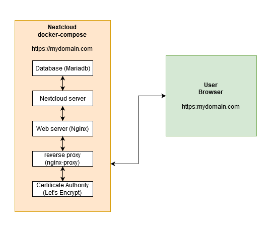
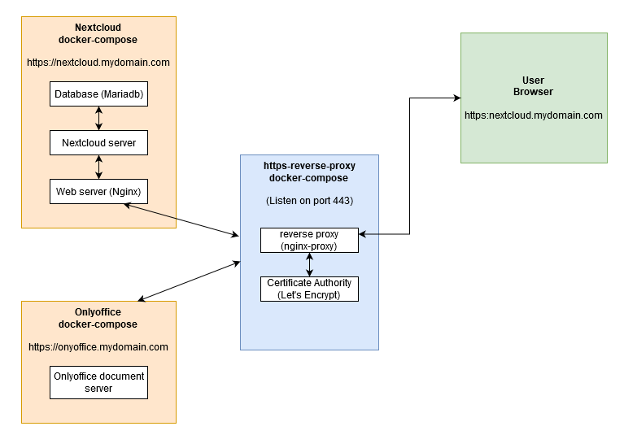

# nextcloud-docker
Nextcloud + OnlyOffice installation with docker and docker compose

## What this repository will get to you : 
- A secure Nextcloud server with https provided by Letsencrypt
- OnlyOffice Integration
- ClamAv antivirus for uploaded files
- A WebDav example for additional disk
- A simple additional virtual web site (nginx welcome page) to get a minimal example on how to extand your web server.

**This repository is intended to share one possibility to host a complete and secure nextcloud server.**

At first i wanted to get a secure and stable nextcloud self-hosted server, and i forced myself with those constraints :

* Stability and easily management that can be offered docker containers
* Security of both data and server, mainly served with https protocol.
* Extendable domain sites : because i didn't want to get my domain to be exclusive for nextcloud, i would like to add other web sites using my domain.
* OnlyOffice integration. We will see that with first three points, this constraint is easy to get ! (And that was exactly what i wanted to with thos 3 first points : easy management, but not to ommit security, and easy extendability !)

# How do this work ? How do we get all those constraints ? 

> Note : This is a general description of the project, I will explain in details each individual step further down the page. 

First, we want the use of docker because it is more stable when multiple applications are launched on the same server, and it can be very easily managed with docker compose. So we start by searching the rights docker images and if possible some examples of their possible docker compose configuration. [And here we get it !](https://hub.docker.com/_/nextcloud/)

So, this is how we get a nextcloud + mariadb + nginx configuration, that will enable us to get an unsecure but working docker compose nextcloud server. that can be access through the server IP adress. This is approximatively what we can found on the src/nextcloud directory (you will see an additional clamav image in it, that i will explain later).

But, for security purpose, we want https protocol, and this can be achieved with the letsencrypt docker image. But to make it work we must get a valid domain (you will probably have to buy one), and a correct DNS configuration to map your domain adress to your server IP. More information about this on the Letsencrypt site web. This is achieved by combining the src/https-reverse-proxy and src/nextcloud directories. Originally, they were merged into one single directory and one single docker-compose file. But, as we will see, this resulted into the impossibility to add another web site in the same server because port 80 and 443 are already use by the nginx container !

So, here is what we get after these step :
resources/standolone-https-nextcloud.png

So, now that we have https enable, our server is secure. But we want it to be extandable, and by that i mean i want the possibility to add another web site on my server (not just the nextcloud one). So, we have one IP adress, accessible through just one port (443 because we want https for all our web sites !). This is here where we cut in two parts our application : one part for the web back end site (nextcloud application for example), and another part to proxy https requests. This results to the two directories src/https-reverse-proxy and src/nextcloud. 

And now, here is our configuration by splitting appart https connection with nextcloud server :

